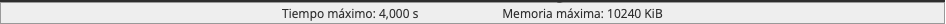
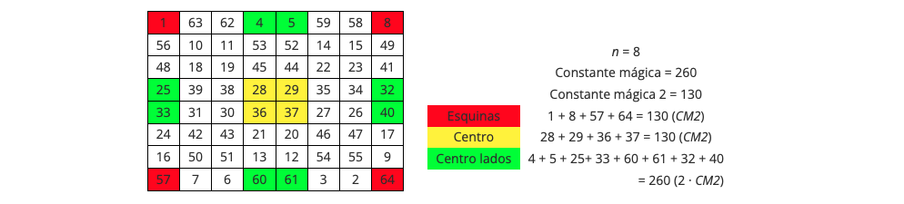
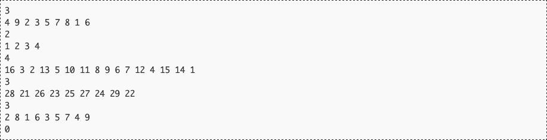
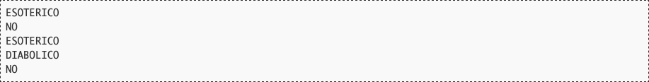

# Cuadrados diabólicos y esotéricos

Se considera un *cuadrado mágico diabólico* a la disposición de una serie de números enteros en un cuadrado de forma tal que la suma de los números por columna, fila y diagonales principales sea la misma. A esta suma se le llama *constante mágica (CM)*. Para nuestro desarrollo consideraremos el cuadrado como una matriz con igual número de filas que de columnas.

Si suponemos n la cantidad de filas o columnas del cuadrado, un cuadrado mágico diabólico es *esotérico* cuando, además de ser *diabólico*, cumple las siguientes condiciones:

1. Tiene las mismas cifras que el número de casillas. Es decir, siguen la serie de números naturales de 1 a n².
2. La suma de sus esquinas debe ser la *constante mágica 2 (CM2)* que cumple que:

3. Si n es impar:
	* La suma de las cifras de las cuatro casillas de la mitad de los laterales suman la *constante mágica 2*.
	* Si se multiplica el valor de la casilla central por 4, se obtiene la *constante mágica 2*.

4. Si n es par:
	* La suma de las dos casillas centrales de cada uno de los cuatro laterales suman el doble de la *constante mágica 2 (2 · CM2)*
	* La suma de las cuatro casillas centrales da como resultado la *constante mágica 2*.

## Entrada

El programa leerá de la entrada estándar un cuadrado mágico tras otro. Cada cuadrado mágico consistirá en dos líneas. La primera línea contendrá el valor de n (2 ≤ n ≤ 1024). La segunda línea será los valores de las n² celdas, uno detrás de otro.

La entrada termina cuando al leer el tamaño del siguiente cuadrado mágico se recibe un 0.

## Salida

Para un cuadrado esotérico, el programa escribirá `ESOTERICO`, para un cuadrado mágico diabólico (no esotérico) escribirá `DIABOLICO`. Para cualquier otro cuadrado, mostrará `NO`.

## Entrada de ejemplo

## Salida de ejemplo

## Lenguaje empleado

	

---

[🛜 Aquí puedes encontrar el sitio web oficial donde se encuentra este reto.](https://aceptaelreto.com/pub/problems/v001/01/st/statements/Spanish/index.html)